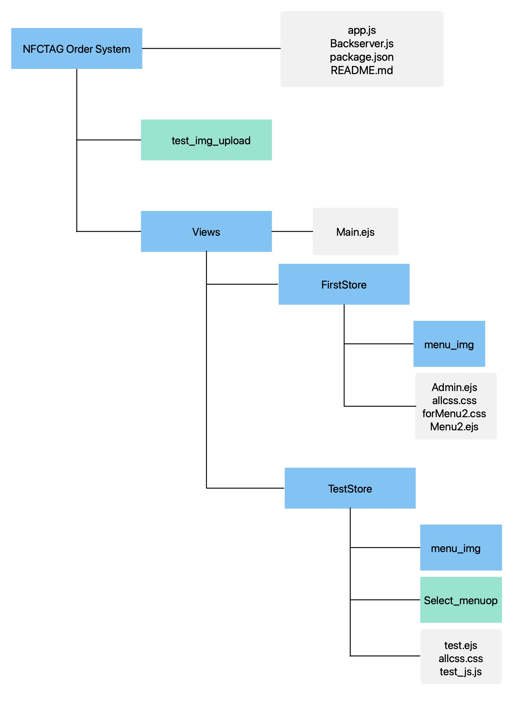
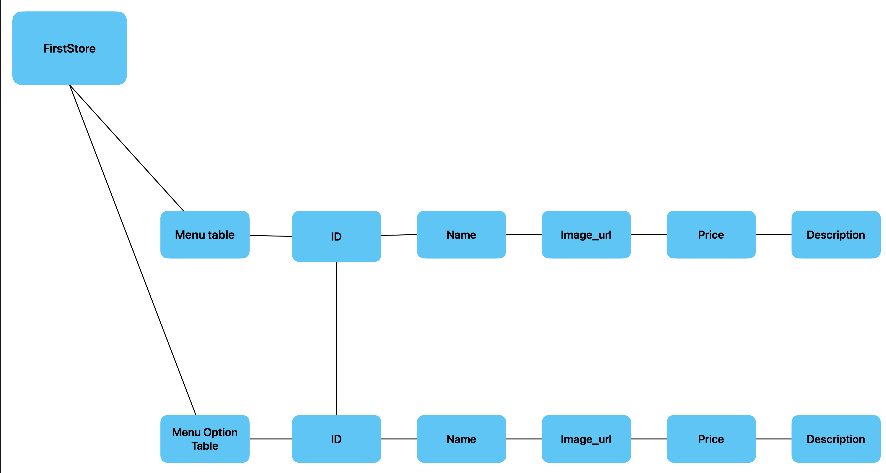

NFC_TAG_Order_System
=============
***
충북대학교 졸업 프로젝트

NFC를 이용한 비접촉 주문 시스템

***
File FlowChart
---------

## NFCTAG Order System File
### app.js
현재 모든 접속 (DB연결, 사용자 접속 등)을 담당하는 페이지

### Backserver.js
테스트용으로 만든 app.js 대체재, 순전히 기능을 시험할 때

이곳에 먼저 적용 후 app.js로 적용을 결정한다.
***
## test_img_upload
*삭제예정*

상점 어드민이 메뉴 사진을 업로드시 저장되는 파일
현재 모든 상점 메뉴사진이 이 파일에 저장되고 있음.
추후 상점파일마다 이미지 파일을 만들 것이기에 임시사용 하는 파일.
***
## Views File

### Main.ejs
접속할 때 해당 페이지를 통하여 menu.ejs를 렌더링하기 위해 임시로 거쳐가는 페이지
현재는 firstStore의 menu2.ejs로만 연결되어 있어 추후 이를 해결하는 방법을 강구해야함
***
## FirstStore
현재 제작하고 있는 샘플 상점페이지, 이를 완성 시 다른 상점들은 이 파일을 복사하여 베이스를 만드는데 사용될 예정

### menu_img
각 상점마다 이미지를 저장하기 위한 파일, 단순히 파일만 만들어 놓고 기능은 하지 않음

### admin.ejs
firstStore의 관리자 페이지.
이곳에서 관리자는 메뉴 업로드, 세부 메뉴 설정, 상점 꾸미기, 정산 등을 해결할 수 있게 제작 될 예정이다.

*현재 구현 상태 : 메뉴 업로드*

### allcss.css
관리자,고객 페이지 모두 공유하는 css를 담은 파일이다.

### forMenu2.css
고객 페이지만의 css를 구축하기 위한 파일이다. 추후 allcss에 통합할지는 결정하지 않았다.

### Menu2.ejs
해당 상점의 고객이 사용하게 될 메뉴 페이지.
관리자가 설정한 메뉴를 골라 장바구니에 담고, 결제까지 할 수 있는 페이지이다.
거의 배달의 민족 어플과 유사하게 제작하였다.
___
## testStore
firstStore에 적용하기 전 기능을 미리 실험하기 위한 상점페이지 파일이다.

### menu_img
각 상점마다 이미지를 저장하기 위한 파일, 단순히 파일만 만들어 놓고 기능은 하지 않음

### Select_menuop
세부 메뉴를 결정하기 위한 페이지를 담는 파일이다.
진행상황은 아래 진행상황에서 서술

### test.ejs
테스트 상점 페이지 파일

### allcss.css
관리자, 고객 페이지 모두 사용하는 css파일

### test_js.js
테스트 상점 js파일
***
# DataBase Chart in development

기본적인 상점들의 메뉴 데이터베이스 흐름도

Menu table이 일반 메뉴들을 추가하며,
Menu Option Table이 위 일반 메뉴들의 추가 메뉴들을 담당한다.

*이 둘은 ID로 Join한다.*

다만 DB쌓아본 적이 없으니 구조가 빈약하기 그지없다.

25/03/18 기준, 이 DB를 토대로 개발을 진행중이나 추후에 테이블 구조를 변경할 수도 있다.
***
## 진행상황 25/03/18

절망적

관리자가 메뉴를 업로드 시 고객페이지에서 확인 가능

사진 업로드는 되는데 불편함

주문까진 가능하나, 결제시스템이 없음, 관리자쪽에 메뉴 주문한 현황 확인 미구현

* 세부 메뉴 선택 미구현, 테이블만 구축 되어있음
* 주문현황 기능 미구현
* 결제 시스템 미구현
* 관리자 페이지 css 미완

* db 재설계 필요?

